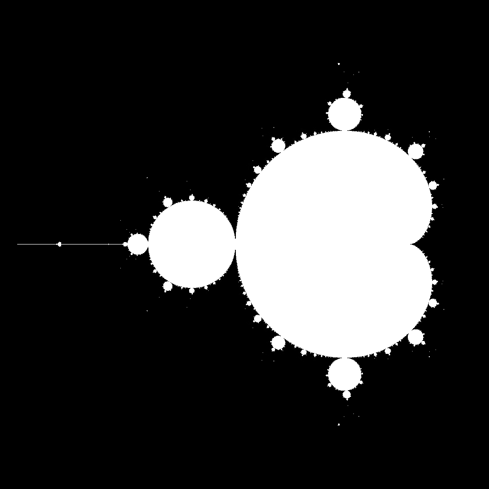

# Mandelbrot Set Computation with MPI

This project implements a parallel computation of the Mandelbrot set using MPI, enabling distributed processing across multiple processes on a cluster. Each process calculates a portion of the Mandelbrot set, and the master process aggregates the results to form the final image.

## Example - 1024x1024 image



## Project Structure

- `mandel_mpi.c`: Main code file for computing the Mandelbrot set.
- `pngwriter.c`: Helper library for writing the computed image to a PNG file.
- `Makefile`: Contains build and run instructions for the program.

## Approach

The program uses a 2D grid of MPI processes to divide the Mandelbrot set image into smaller subdomains. Each process calculates its assigned subdomain, and the master process (rank 0) aggregates the subdomains into the final image. 

The approach includes:
- **Image Partitioning**: Dividing the image into subdomains for each MPI process using a Cartesian communicator.
- **Subdomain Computation**: Each process computes its designated subdomain based on its location in the grid.
- **Data Aggregation**: The master process collects subdomain data from each process to compile the full image.

## Building the Project

To build the project, you can use the provided Makefile:

```bash
make
```

This will compile the `mandel_mpi` executable, linking it with necessary libraries (such as `libpng` for image output). Ensure `libpng` is installed on your system.

## Running the Program

To run the program, you need to specify the number of processes with `mpirun`. By default, the Makefile runs the program with 4 processes, but you can adjust this by setting the `NPROC` variable.

```bash
make run
```

or directly using `mpirun`:

```bash
mpirun -np <NUM_PROCESSES> ./mandel_mpi
```

Replace `<NUM_PROCESSES>` with the desired number of processes (e.g., 8). Each process computes a portion of the image in parallel.

## Program Parameters

- **Image Dimensions**: The image is computed at a default resolution of \(4096 \times 4096\) pixels.
- **Process Grid**: The process grid is automatically determined using `MPI_Dims_create` for optimal load balancing across processes.
- **Synchronization**: A barrier synchronization ensures all processes complete their computation before sending data to the master process, preventing deadlocks.

## Example

```bash
mpirun -np 8 ./mandel_mpi
```

This command computes the Mandelbrot set using 8 processes. The result is saved as a PNG image file.

## Cleaning Up

To remove compiled files, use:

```bash
make clean
```

## Performance

The performance of this program can be analyzed by running it with different numbers of processes and measuring the execution time. Higher process counts generally improve performance, up to the limit imposed by the problem's parallel efficiency.
